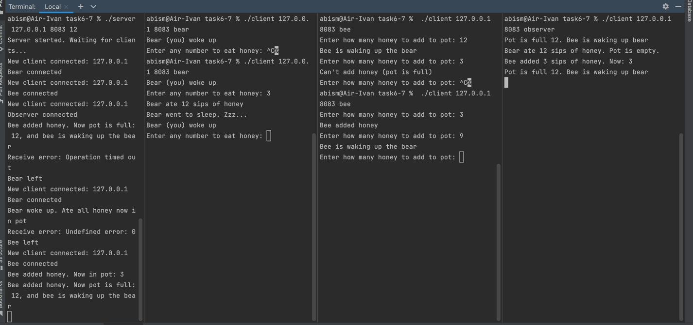

# OS_HW_3

# Операционные системы. ИДЗ № 3. Вариант 2 <br/> Киселев Иван Александрович БПИ217.

## Условие:

> Задача о Винни-Пухе – 1 или правильные пчелы. В одном лесу живут n пчел и один медведь, которые используют один горшок меда, вместимостью Н глотков. Сначала горшок пустой. Пока горшок не наполнится, медведь спит. Как только горшок заполняется, медведь просыпается и съедает весь мед, после чего снова засыпает. Каждая пчела многократно собирает по одному глотку меда и кладет его в горшок. Пчела, которая приносит последнюю порцию меда, будит медведя. Создать приложение, моделирующее поведение пчел и медведя. Медведя и каждую из пчел представить отдельными процессами.
## Описание репозитория:

### Решения задачи на C на 10 балов

**Папки с решениями, находятся в корневой папке репозитория**

Каждая папка содержит в себе:

> * Файлы на языке C с решением задачи на указанный в названии папки балл
>
> * Исполняемые файлы

**Текстовые файлы с входными данными для тестов, также лежат в корневой папке репозитория**

## Отсчет:

### Как запускать программу
На 4-6:
Программы сначала компилируются
```
gcc -o prog.exe prog.c
```
Для запуска севера надо ввести адрес порт и максимальное количество меда в горшке:
```
./server 127.0.0.1 8083 12
```

Для запуска клиента надо ввести адрес порт и тип клиента (bee/bear):
```
./client 127.0.0.1 8083 bear
./client 127.0.0.1 8083 bee
./client 127.0.0.1 8083 observer
```


### Сценарий решаемой задачи
**Задание на 4,5 баллов:**
> Клиенты (медведь или пчела) обращаются к серверу, медведь 
> получает входящее, которое его будит, затем ему предлагают съесть мед,
> после того, как он согласится, он отправит сообщение на сервер, и мед исчезнет из горшка. 
> Пчелам же предлагают ввести и (отправить на сервер) количество глотков меда, которые они внесут в улей, 
> в ответ им сервер выдает сообщение смогли ли они добавить мед, а также надо ли будить медведя.
>
> Завершать программы клиентов допускается сигналом завершения (SIGINT)

**Задание на 6, 7, 8, 9  баллов:**
> Добавлен типа клиента наблюдатель (observer).
> Он получает сообщения об изменениях от сервера.
> В тестах продемонстрирована возможность обустройства нескольких наблюдателей
> Также есть возможность добавление любого количества клиентов пчел и медведей, однако суммарно нельзя, чтобы из было более 10 (это можно поправить в коде, если будет надобность)


**Задание на 10 баллов**
> Добавлены доп сообщения о завершении сервера
> 
### Тестирование программ:
Произведены тесты всех программ, результаты расположены в папках программ
**Задание на 4-5 балла:**


Далее показано, как клиенты уходят, сервер понимает, что медведь ушел, только тогда, когда мед заполняется,
но при уходе пчелы сразу сообщает об этом. (Когда медведь возвращается ему предложат доесть мед, если он был в горшке)

(То есть отсоединение и присоединение клиентов медведя и пчелы работает корректно)


**Задание на 6-7 баллов:**

Здесь показана работа observer


 
Здесь его корректное отсоединение (понятно, что можно далее и присоединить).


**Задание на 8 баллов:**

Как видно, к серверу можно подключать несколько клиентов наблюдателей


**Задание на 9 баллов:**
Как здесь видно, мы может подключать и отключать клиентов, 
весь их прогресс при этом сохраняется


**Задание на 10 баллов:**
Как мы видим, при завершении сервера другие клиенты,
при любом обновлении их стейта относительно сети корректно отключатся


Также если надо могу записать видео с работой программы, но не так много сил сейчас,
так что может быть позже добавлю

Приятного лета!